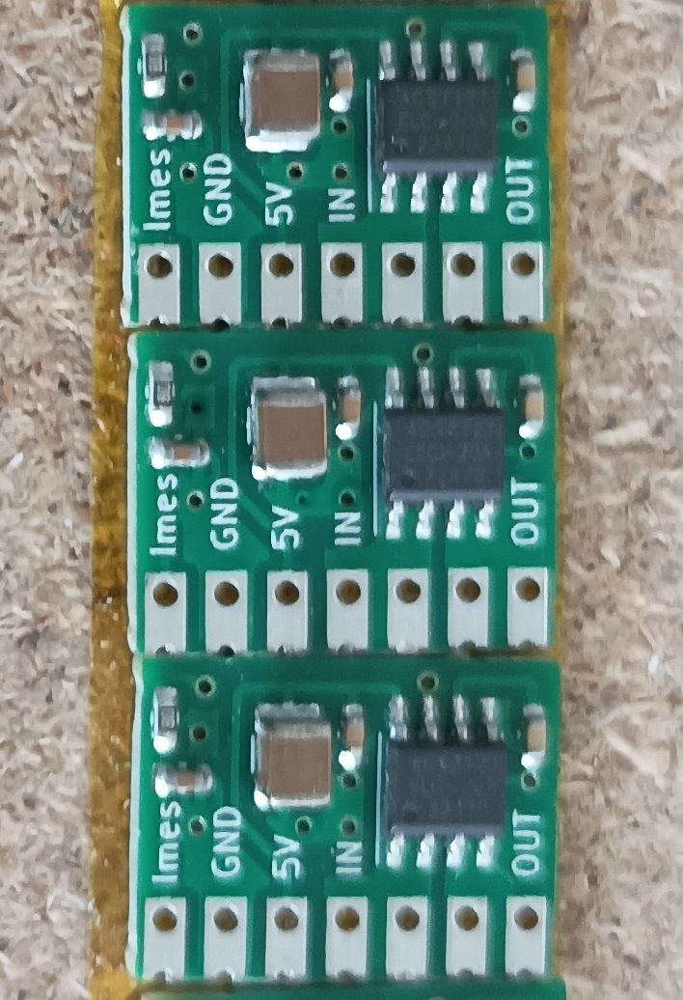
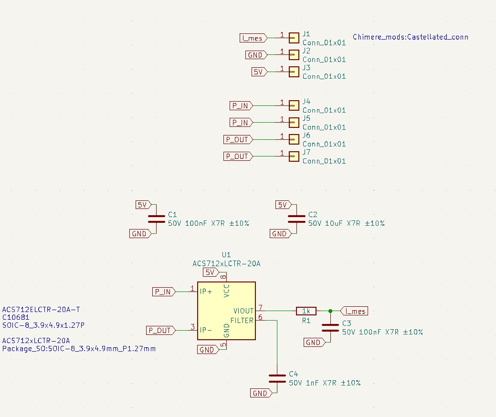

# 18_Mesure_Courant
 Mesure courant 

Le module Mesure_courant permet de mesurer un courant sur circuit alternatif ou continu.
La tension sur la broche Imes est proportionnelle au courrant consommé par le circuit à raison de 0.066 V par ampère.
Il s'agit d'un capteur à effet Hall, il peut donc être perturbé si un champ magnétique est à proximité.

## Schéma

Plus d'information sur la [datasheet du Alegro ACS712](https://www.allegromicro.com/~/media/files/datasheets/acs712-datasheet.ashx).

## Fonctionnalités
- Petit (14,6x17,8 mm)
- Faible coût (2 couches avec composants d'un seul côté)
- Connecteur avec pas de 2.54 mm + empreinte crénelée pour connexion carte à carte

## Outils utilisés

- [Kicad V6](https://www.kicad.org/)

## Fabrication du circuit

Ce circuit a été testé de fond en comble sur de nombreux projets

## Contributeurs

- Thierry Orlandi ([Hardware Freelance](https://www.linkedin.com/in/thierry-orlandi))
- Yohann Belair ([R&D Freelance](https://github.com/ciborg971))

## Licence
[CERN Open Hardware Licence Version 2](https://github.com/Thierry-oshw/18_Mesure_Courant/blob/main/LICENSE.txt)